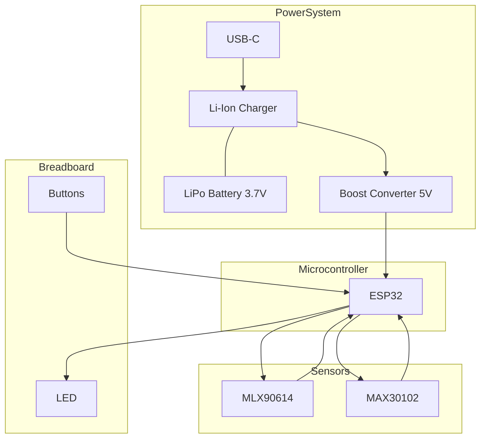

```mermaid
graph TD

subgraph PowerSystem
    USB[USB-C]
    Charger[Li-Ion Charger]
    Bat[LiPo Battery 3.7V]
    Boost[Boost Converter 5V]

    USB --> Charger
    Charger --> Boost
    Charger --- Bat
end

subgraph Microcontroller
    ESP[ESP32]
end

subgraph Breadboard
    BTN[Buttons]
    LED[LED]
end

subgraph Sensors
    MLX[MLX90614]
    MAX[MAX30102]
end

Boost --> ESP

BTN --> ESP
ESP --> LED

MLX --> ESP
MAX --> ESP

ESP --> MLX
ESP --> MAX
```
